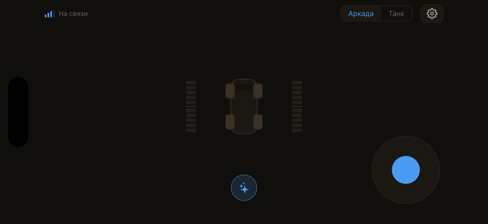
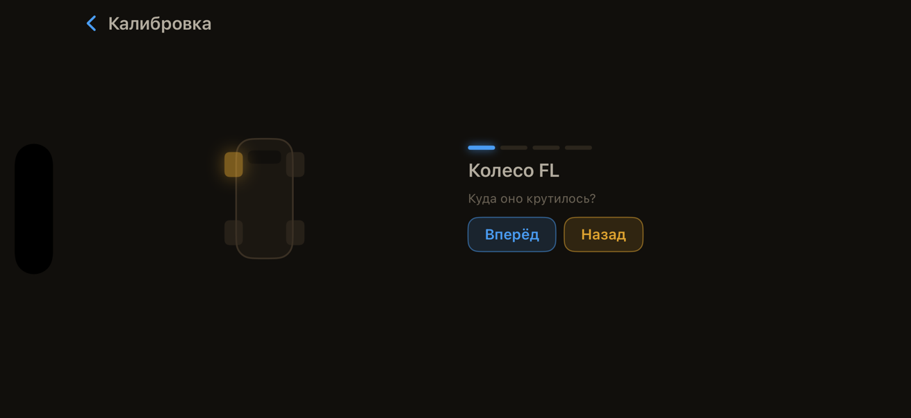
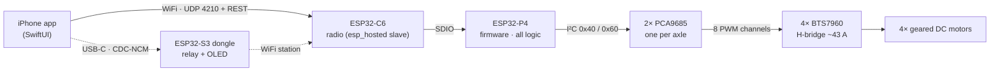
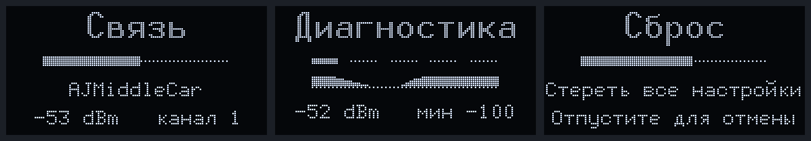

# AJMiddleCar

### Waveshare ESP32-P4-Module-DEV-KIT · 4WD RC car · tank-turn, realtime joystick control, native iOS pult


A WiFi-controlled four-wheel-drive RC car. The board hosts its own access point; a native SwiftUI
app drives it over a 10 Hz UDP control channel and a small REST API — tank-turn mixing,
on-wheels motor calibration, a control-link watchdog, link-loss auto-return, one-tap trick
macros with trajectory simulation, and over-the-air firmware updates for every processor in the
system from a single GitHub Release.

The middle sibling of **[AJPicoCar](https://github.com/ajohnson-smarthome/AJPicoCar)**, which
runs the same design on a XIAO ESP32-C6. Same protocol, same feel, more room to grow.

<table>
  <tr>
    <td align="center"><br/><sub><b>Drive</b> — joystick · live wheel bars · tricks ✦ · arcade / tank</sub></td>
    <td align="center"><br/><sub><b>Calibration</b> — a wheel spins, you say which way it went</sub></td>
  </tr>
</table>

> Russian-localised UI · warm light/dark themes · landscape-locked. The whole flow iterates
> hardware-free against a localhost mock car in the iOS Simulator.

## Three processors, one release

ESP32-P4 ships without WiFi. The board pairs it with an **ESP32-C6 over SDIO**, and
`esp_wifi_remote` makes that invisible: the firmware calls the ordinary `esp_wifi` API and the
calls travel to the co-processor. The C6 is a modem running a vendor image we pin but never
author — and that image is **embedded inside the car's own firmware**, so the car flashes its
radio itself when the versions disagree. One OTA, both processors.

The third processor is optional and lives in a pocket: an **ESP32-S3 USB-Ethernet dongle** that
plugs into the phone, joins the car's network as a station, and relays the control channel and
the REST API over the wire. The phone's own WiFi stays free. The dongle has a 0.96″ OLED that
says what it is doing, and it updates over the same USB link from the same release.



What the P4 buys over the pico car: 32 MB of PSRAM, 16 MB of flash, a hardware H.264 encoder and
MIPI-CSI/DSI — none of which is used yet, all of which is why this board.

## Features

**Driving**
- **4WD tank-turn mixing** — throttle and yaw blend into left/right side speeds
  (`left = t+y`, `right = t−y`, normalised), shoot-through-safe by construction: per wheel
  exactly one of the H-bridge pair is ever nonzero, and a failed I²C write marks that channel
  unknown rather than trusting a value the chip may not hold
- **Realtime control over UDP** — `hello` opens a session, commands stream at 10 Hz with a
  sequence gate, telemetry comes back at 5 Hz; parsed by a pure zero-alloc parser, no JSON
  library on the control path
- **An arbiter for the motors** — six sources may command the actuator (`rt`, `console`,
  `calib`, `recover`, `ota`, `safe`) with a strict rank; a 50 Hz task is the sole writer to the
  PWM chips and ramps every rise, never a fall
- **Control-link watchdog** — 300 ms without a command and the car reacts
- **Link-loss auto-return** — a breadcrumb ring of recent commands replays reversed and negated,
  retracing the car back into range and aborting the instant a frame arrives
- **On-wheels calibration** — spin each motor pair, tap the wheel that turned, pick a direction;
  a swapped cable costs nothing
- **Tricks** — spin, figure-8, wiggle, donut; each with editable geometry and an animated
  top-down trajectory simulation that previews exactly what will be streamed

**Updating and staying honest**
- **One release, every processor** — `tools/release.sh` builds the radio image from the pinned
  `esp_hosted`, embeds it in the car's image, builds the dongle, and publishes both binaries
  under one tag `v<semver>+<build>`; the app force-updates whichever board is behind
- **Rollback that means it** — an image that fails before it has proved it can serve `/ota` is
  rolled back by the bootloader; nothing after that point is allowed to panic
- **`/status` that cannot lie in the reassuring direction** — `bus_ok` is false unless both PWM
  boards finished their init, the reported RSSI is the session owner's station, and the dongle's
  fault record carries its age so "failing now" and "failed once at boot" read differently
- **Two cars, one bench** — both cars serve the same API at the same address, so each pult
  checks the car's device identifier and refuses to drive the other one

**The dongle's panel**
- Fifteen screens on a 128×64 OLED, one template: a word in 10×20, a rule that is a dashed
  line, a level gauge, a 46-second signal history or the page markers, and up to two rows in
  6×12. Nine are chosen by the dongle itself, five are paged to, one counts down.
  Only the dongle's own measurements — never the car's telemetry, never "hertz"
- A short press of BOOT pages through five reference pages (signal, address, radio, relay,
  faults); a five-second hold counts down on the gauge and erases NVS

<p align="center"><br/>
<sub>Rendered from the firmware's own <code>screens.c</code> and fonts — these are the pixels the panel lights.</sub></p>

**Engineering**
- **The contract is a file** — `contract/car-api.json` is the source of truth for the protocol
  version, the real-time constants and the five config domains; `tools/gen_contract.py` emits
  the firmware's descriptor table, the app's Swift structs, the mock's validator and the endpoint
  table in `docs/protocol.md`, and the tree fails if any of them drift
- **JSON everywhere** — every wire format and every stored setting, one JSON string per domain
  in NVS with a dirty check so unchanged saves do not touch flash
- **Pure, host-tested modules** — mixing, PWM planning, the actuator planner, frame parsing,
  the watchdog, recovery, calibration, geometry, the dongle's join state machine, session
  table, relay backlog and every panel screen compile with plain `cc` and run on the host
- **Hardware-free dev loop** — `tools/test-all.sh` runs the contract check, every C and Swift host
  test, the mock's tests and a conformance sweep against the mock in one command

## Build

```bash
source tools/env-p4.sh                                          # ESP-IDF 6.0.2
cd firmware/car/core && idf.py build && idf.py -p /dev/cu.usbmodem* flash monitor
cd firmware/dongle   && idf.py build && idf.py -p /dev/cu.usbmodem* flash
```

| | |
|---|---|
| Everything without hardware | `tools/test-all.sh` |
| iOS app | `cd app && xcodegen generate && open AJMiddleCar.xcodeproj` |
| Mock car for the simulator | `cd tools/mock_car && .venv/bin/python mock_car.py` |
| Cut a release | `tools/release.sh --dry-run`, then `tools/release.sh "notes"` |
| Radio image by hand (rare) | `firmware/car/modem/flash-radio.sh` — see [its README](firmware/car/modem/README.md) |

The dongle's own board notes, its bench log and the USB update path are in
[`firmware/dongle/README.md`](firmware/dongle/README.md).

## Layout

```
app/                 iOS pult (XcodeGen; the .xcodeproj is generated and gitignored)
contract/            car-api.json, dongle-api.json — what both sides agree on
firmware/
  car/core/          the car's firmware — all logic
  car/modem/         the radio's slave image build
  dongle/            the USB-Ethernet dongle — knows nothing about the car
tools/               mock car, contract generator, conformance, release script
docs/                protocol.md · bringup.md · specs · plans · research
```

`app/` and `firmware/car/core/` never reference each other. The contract between them is
[`docs/protocol.md`](docs/protocol.md), and `tools/mock_car` is that contract made executable.
`firmware/dongle/` knows nothing about the car at all — not the motors, not the protocol; it
moves bytes and says how many.

## Status

Running on hardware since 2026-08-20. The car boots, brings up its access point, updated its
own radio from the shipped image to the pinned one over SDIO on the first day, and turned its
motors from the console the day the PCA9685 boards were wired. The dongle has updated both
boards over the air from the phone, and its panel came up on the bench on 2026-09-06.
[`docs/bringup.md`](docs/bringup.md) is the live record of what the board has and has not
answered yet — the wizard, a drive on both schemes and a watchdog trip are still open there.

## License

MIT — see [LICENSE](LICENSE).
