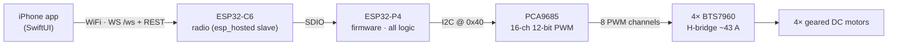

# AJMiddleCar

### Waveshare ESP32-P4-Module-DEV-KIT · 4WD RC car · tank-turn, realtime joystick control, native iOS pult


A WiFi-controlled four-wheel-drive RC car. The board hosts its own access point and a
REST/WebSocket API that a native SwiftUI app drives — tank-turn mixing, on-wheels motor
calibration, a control-link watchdog, link-loss auto-return, one-tap trick macros with
trajectory simulation, and in-app over-the-air firmware updates from GitHub Releases.

The middle sibling of **[AJPicoCar](https://github.com/ajohnson-smarthome/AJPicoCar)**, which
runs the same design on a XIAO ESP32-C6. Same protocol, same feel, more room to grow.

## The interesting part: the P4 has no radio

ESP32-P4 ships without WiFi or Bluetooth. This board pairs it with an **ESP32-C6 over SDIO**,
and `esp_wifi_remote` makes that invisible: the firmware calls the ordinary `esp_wifi` API and
the calls travel to the co-processor. The C6 stops being a brain — on the pico car it *is* the
brain — and becomes a modem running a vendor image we pin but never author.

What that buys: 32 MB of PSRAM, 16 MB of flash, a hardware H.264 encoder and MIPI-CSI/DSI, all
of which the pico car has no room for.



## Features

- **4WD tank-turn mixing** — throttle and yaw blend into left/right side speeds
  (`left = t+y`, `right = t−y`, normalised), shoot-through-safe by construction
- **Realtime control** — WebSocket `/ws` streaming `{"t":..,"y":..}` at 10 Hz, parsed by a pure
  zero-alloc hot-path parser; no JSON library on the control path
- **Control-link watchdog** — 50 Hz check; 300 ms without a frame and the car reacts
- **Link-loss auto-return** — a breadcrumb buffer of recent commands is replayed reversed and
  negated, retracing the car back into range and aborting the instant the link returns
- **On-wheels calibration** — spin each motor pair, tap the wheel that turned, pick a direction
- **Tricks** — spin, figure-8, wiggle, donut; each with editable geometry and an animated
  top-down trajectory simulation that previews exactly what will be streamed
- **Launch gate + OTA** — the app checks the internet, fetches the latest release, connects,
  force-updates a lagging board over `POST /ota`, then drives
- **Two cars, one bench** — both cars serve the same API at the same address, so each pult
  checks the car's device identifier and refuses to drive the other one
- **JSON everywhere** — every wire format and every stored setting, one JSON string per domain
  in NVS with a dirty check so unchanged saves do not touch flash
- **Pure, host-tested modules** — mixing, PWM planning, frame parsing, watchdog, recovery,
  calibration and geometry compile with plain `cc` and run on the host
- **Hardware-free dev loop** — the simulator drives a localhost mock car

## Build

```bash
source tools/env-p4.sh
cd firmware/p4 && idf.py build && idf.py -p /dev/cu.usbmodem* flash monitor
```

Host tests: `cd firmware/p4/test && make run`
iOS app: `cd app && xcodegen generate && open AJMiddleCar.xcodeproj`
Mock car: `cd tools/mock_car && .venv/bin/python mock_car.py`
The radio's image is flashed once by wire — `firmware/c6/flash-radio.sh`, and `firmware/c6/README.md`.

## Layout

```
app/            iOS pult
firmware/p4/    the car's firmware — all logic
firmware/c6/    the radio's slave image build
tools/          mock car, release script, IDF environment
docs/           protocol.md · bringup.md · specs · plans · research
```

`app/` and `firmware/p4/` never reference each other. The contract between them is
[`docs/protocol.md`](docs/protocol.md), and `tools/mock_car` is that contract made executable.

## Status

Ported from AJPicoCar with feature parity and **not yet run on hardware** — the board was on
order while this was written, so every hardware assumption is quarantined in
`firmware/p4/main/board.h` and listed in [`docs/bringup.md`](docs/bringup.md). Everything
provable at a desk is proven; screenshots follow once it drives.

## License

MIT — see [LICENSE](LICENSE).
